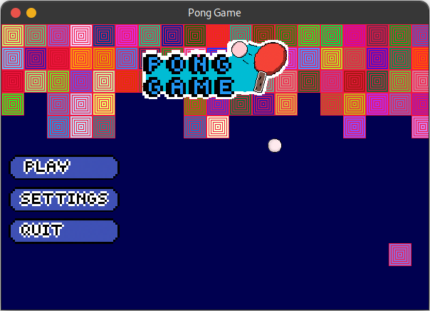

# Pong Game



## Description

This project is a simple pong game made with my "game engine". The
main purpose of this project is to practise my overall abilities in
game development.

### Conclusion

What I have learned in developing this minigame is

* Before writing code, design it first. When designing code, you'll
  be able to check out possible problems that may arise in the
  program, have an established objective, and write tests that have
  good code coverage.

* Good programmers always put control points in their code, making it
  easier to modify later. A simple example of creating control points
  is by simply creating constants when necessary, like when creating
  an instance of a window, you need to specify a width and a height.

## Requirements

* python>=3.7
* pip
* venv (if you want to create a separate python environment to run the
  minigame)

## Dependencies

* pygame

## How to run the project

1. Clone the project

    `git clone https://github.com/smolBlackCat/pong-game.git`

2. Make sure you have the dependencies installed for the game to run

    `pip install pygame`

It's recommended to use this command on a virtual python environment
rather than installing the library to the system's python libs.

3. Run the project

    ```sh
    cd pong-game/ # Go into the project's directory
    python3 src/pong.py
    ```

After that, you should see the minigame window.